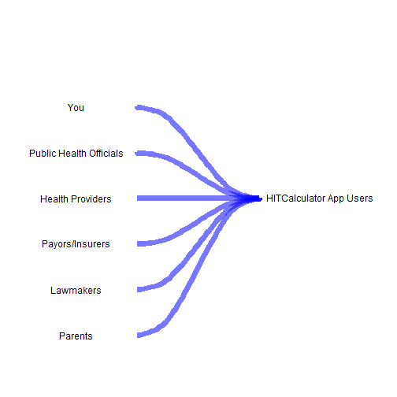
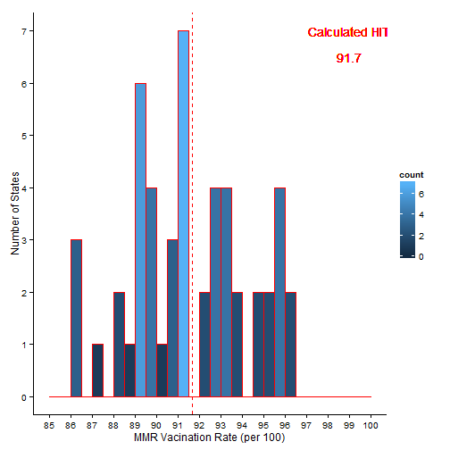

## Introducing HITCalculator v1.0!

1. <h3>What this shiny app does:</h3>
   
&nbsp;&nbsp;&nbsp;&nbsp;The HITCalculator is a simple, novel app that does 3 cool things:  
   
&nbsp;&nbsp;&nbsp;&nbsp;a.  Calculates HIT - a Vaccination (or herd immunity) threshold based on 2 user inputs  
&nbsp;&nbsp;&nbsp;&nbsp;b.  Displays a histogram of USA 2013 MMR vaccination rates for Children (19-35 mos)  
&nbsp;&nbsp;&nbsp;&nbsp;c.  Displays 2 USA state maps:   
     
&nbsp;&nbsp;&nbsp;&nbsp;&nbsp;&nbsp;(i)  States colored by MMR vaccination level   
&nbsp;&nbsp;&nbsp;&nbsp;&nbsp;&nbsp;(ii) States colored to show those which fall below the calculated HIT or at/above the HIT  

---

## 2. Why the app is important

> - Unique! - a similar app does not yet exist in the public domain  
> - Insightful! - a benchmark combined with state vaccination rates provides important context for evaluating potential measles outbreak risks  
> - Graphs! - plots and graphs make it easy to visualize the statistical frequency and regional differences  
> - Simple! - only two imputs required  

---

## 3. Who may be interested?
<h3> Potential Users/Stakeholders:</h3>
 


--- 


## 4. How it works

A sample calculation of an HIT (Herd Immunity Threshold):

$$V_c=\frac{1-1/R_0}{E}$$

R=Basic Reproduction Number between 12-18 for measles.   
CHOOSE 12

E = Effectiveness of the immunity/vaccine.  
CHOOSE 1.00


```
## Ro entered=  12
```

```
## E entered=  1
```

```
## Vc calculated=  91.66667  %
```

--- 


## 5. Example of Plot Output Produced

Here is the shiny app "plot" histogram produced by R code embedded in this slidify presentation:

 


